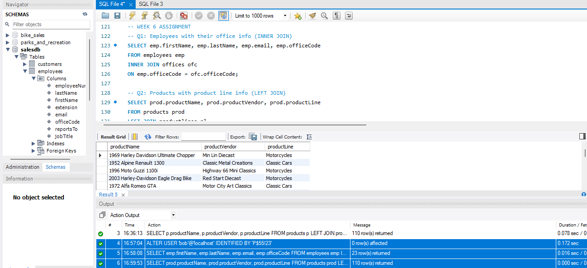

# 📝 **Assignment: Joins and Relationships**

## 🎯 **Learning Objectives**
* ➕ Understand and implement **INNER JOIN**, **LEFT JOIN**, and **RIGHT JOIN** in SQL.
* 👨‍💻 Retrieve data from multiple related tables using SQL queries.
* 🔗 Explore relationships between different tables (e.g., employees, products, orders).
* 💻 Practice real-world SQL scenarios that involve combining tables and retrieving relevant data.

---

## 📋 **What You'll Need**
* 💻 A computer with internet access.
* ✍️ A code editor (e.g., Visual Studio Code).
* 🖥️ MySQL Workbench or another SQL database environment.

---

## 📝 **Submission Instructions**  
📂 Write all your SQL queries in the **answers.sql** file.  
✍️ Answer each question concisely and make sure your queries are clear and correct.  
🗣️ Structure your responses clearly, and use comments if necessary to explain your approach.

---

## 📚 **Assignment Questions**

### **Question 1 🧑‍💼**  
**Write an SQL query** to get the **firstName**, **lastName**, **email**, and **officeCode** of all employees.  
Use an **INNER JOIN** to combine the **employees** table with the **offices** table using the **officeCode** column.

---

### **Question 2 🛍️**  
**Write an SQL query** to get the **productName**, **productVendor**, and **productLine** from the **products** table.  
Use a **LEFT JOIN** to combine the **products** table with the **productlines** table using the **productLine** column.

---

### **Question 3 📦**  
**Write an SQL query** to retrieve the **orderDate**, **shippedDate**, **status**, and **customerNumber** for the first 10 orders.  
Use a **RIGHT JOIN** to combine the **customers** table with the **orders** table using the **customerNumber** column.

---

Good luck 🚀

---

### Illustration

